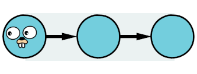

# Iter



[](https://pkg.go.dev/github.com/theMagicalKarp/iter)
[](https://goreportcard.com/report/github.com/theMagicalKarp/iter)

Iter is a _simple_ and _ergonomic_ package for implementing and utilizing
iterators in Golang.

> [!NOTE]
> [Discussion for Native Iterators in Go](https://github.com/golang/go/issues/61897)
> 
> This project welcomes and acknowledges this discussion but does not currently align with the proposal.

## Features

- Easy to implement Iterable interface
- Standardized toolset for utilizing iterables

## Limitions

While this package aims to provide a fluid way of writing code, it also strives
to be as efficient as possible. However, due to the inherent nature and
idiosyncrasies of Go, it will always be more efficient to write code that
utilizes the language's primitives.

This package does not aim to be the fastest way to run Go.

## Getting Started

```Go
package main

import (
	"github.com/theMagicalKarp/iter/pkg/iter"
	"github.com/theMagicalKarp/iter/pkg/itertools"
)

func main() {
	// create iterator from static values
	numbers := iter.New(0, 1, 2, 3, 4, 5, 6, 7, 8, 9)

	// filter to collect even numbers
	evenNumbers := itertools.Filter(numbers, func(n int) bool {
		return n%2 == 0
	})

	// square numbers and convert to strings
	squaredNumbers := itertools.Map(evenNumbers, func(n int) int {
		return n*n
	})

	itertools.Print(squaredNumbers)
	// 0, 4, 16, 36, 64
}
```

## How

Everything in the iter packages utilizes a single interface for reading data.

```Go
// Iterable represents a generic iterable collection.
type Iterable[T any] interface {
	// Next returns the next element in the collection and a boolean value indicating if the value was found.
	Next() (T, bool)
}
```

## Why

Universal iterable interfaces are foundational to powerful problem solving. When
using iterables as the standard for functional communication, you can create and
utilize standard sets of libraries and structs seamlessly. This results in
clever and easy-to-understand solutions.

Since many of the itertools functions accept and return iterables, you can plug
and play various functions to achieve a desired result.

## Test

```Shell
go test ./...
golangci-lint run
```
